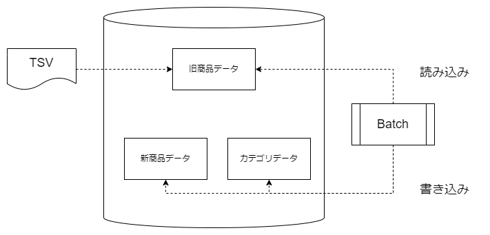

# 商品データ移行プロジェクト

## 概要
- 商品データ移行プロジェクト
  - 商品分類のデータ保持方法を変更するため、140 万件の商品データを移行
  - データを正規化して複数テーブルに分割
  - テキストで保存されている商品のカテゴリを階層化
  - Spring Batch を使用して移行バッチを作成

## 詳細
- Spring Batch のキャッチアップ
- 移行元・移行先のテーブルを用意
- 移行処理の設計
- TSV ファイルを DB のテーブルにロード
- 移行元テーブルから商品カテゴリを個別に抽出して移行
- 移行元テーブルから商品データを移行
  - データの整合性をチェックし、移行できないデータをファイルに書き出し
- データ移行実施

 <!-- ![マークダウンサンプル] -->
 <!-- HTMLでの記法でサイズ、位置などが変更できる-->

  

 

### 1.Spring Batch のキャッチアップ
[旧商品データ]テーブルから[新商品データ]テーブル、[カテゴリーデータ]テーブルにデータを移行するため、Spring Batch を使用して移行バッチを作成する。Spring Batch はバッチ処理を行うためのフレームワークで、バッチ処理で必要になる多くの便利な機能を有している。インターネット等で調べ、Spring Batch の使い方を把握する

### 2.移行元・移行先のテーブルを用意
移行元テーブル：[旧商品データ]テーブル(original)

移行先テーブル：[新商品データ]テーブル(items)、[カテゴリーデータ]テーブル(category)

[要件](./docs/requirements/README.md)に、各テーブルの定義があるので、それに従ってDDLを作成しテーブルを作成する

### 3.移行処理の設計
データ移行の処理をSpring Batchを使用して実装する前に、クラス図とシーケンス図を作成する。クラス図、シーケン図ともにツールはmarmaidを使用して作成する。（marmaidの使い方、シーケンス図の書き方等についてはインターネット等で調べて実施する）

移行の処理については、別途[要件](./docs/requirements/README.md)が定められているため、そちらを考慮して設計する。但し、実装しないと見えてこない部分もあるかと思うので、最初の設計はある程度ラフにおこない、実装しながら修正していくという流れでも構わない

### 4.TSVファイルをoriginalテーブルにロード
`original`テーブル用のデータがTSVファイルで提供されているので、それをDBのテーブルにロードする。ロードの仕方はインターネット等で調べて実施する。（ロードのためのJavaプログラムを作成するわけではない）

### 5.移行バッチの実装
「3.」の設計に基づき、Spring Batch を使用して移行バッチを実装する。本テンプレートリポジトリーから自身のアカウントにリポジトリーを作成（複製）し、そこで作業を進める。テンプレートからのリポジトリー作成のやり方は以下を参照
 - https://docs.github.com/ja/repositories/creating-and-managing-repositories/creating-a-repository-from-a-template

### 6.移行バッチの実行
移行バッチを実行し、データの移行が正常に行われたかどうかを確認する

- エラーレコードが「6327」件であることを確認する

- 最上位カテゴリーごとの商品数が以下になっていることを確認する

| 最上位カテゴリ | 商品数 |
| --- | ---: |
| Women | 664,385 |
| Beauty | 207,828 |
| Kids | 171,689 |
| Electronics | 122,690 |
| Men | 93,680 |
| Home | 67,871 |
| Vintage & Collectibles | 46,530 |
| Other | 45,351 |
| Handmade | 30,842 |
| Sports & Outdoors | 25,342 |
| 合計 | 1,476,208 |

