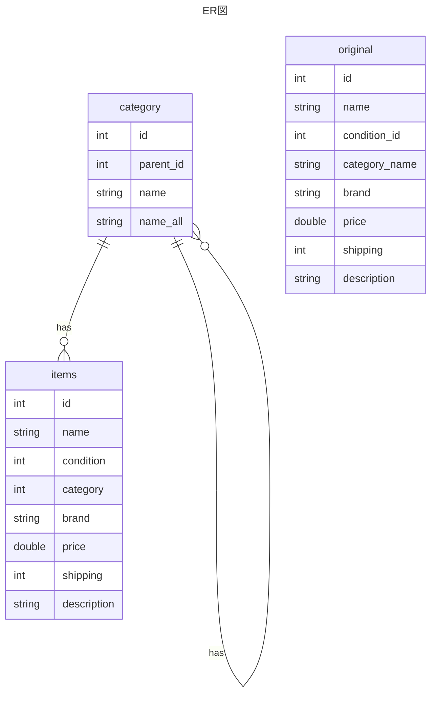

# 移行処理の要件

### 概要

- テーブル定義
- original テーブルから category テーブルへのカテゴリー情報の移行
- original テーブルから items テーブルへの商品情報の移行
- バッチ処理進捗状況のコンソールへの出力
- エラーレコードの出力
- ロールバック
- 処理時間

### 1. テーブル定義

各テーブルの定義は以下の通り（DB 名は自由に決めてよい）



### 2. original テーブルから category テーブルへのカテゴリー情報の移行

original テーブルの「category_name」列の値を元に category テーブルを作成する

「category_name」列は `/` 区切りで商品のカテゴリが記載されている

```plaintext
Men/Tops/T-shirts
```

これらを次の形式で category テーブルに格納する

| id  | name    | parent_id | name_all          |
| --- | ------- | --------- | ----------------- |
| 1   | Men     | null      | null              |
| 2   | Tops    | 1         | null              |
| 3   | T-shirt | 2         | Men/Tops/T-shirts |

- 最上位カテゴリの `Men` には、parent_id、name_all に `null` を設定
- 次のカテゴリである `Tops` には、親である `Men` の id が parent_id として入り、name_all は `null` を設定
- 最下位カテゴリである `T-shirts` の parent_id は `Tops` の id が入り、name_all には**上層カテゴリの name をスラッシュで連結した文字列**を設定

ただし、original テーブル上のデータでカテゴリが 4 つ以上に分解できるデータについては、3 つ目のカテゴリまでを category テーブルに格納する（4 階層目以下のカテゴリー情報は切り捨てて良い）

```plaintext
例:
Men/Clothes/Tops/T-shirts
-> Men/Clothes/Tops までカテゴリテーブルに追加する。T-shirts は追加しない
```

### ３. original テーブルから items テーブルへの商品情報の移行

original テーブルから items テーブルに商品情報を取り込む

- `items.id`

  - 自動採番

- `items.name,brand,price,shipping,description`

  - `original.name,brand,price,shipping,description` の値をそのまま設定する

- `items.condition`

  - `original.condition_id` の値をそのまま設定する

- `items.category`
  - `original.category_name` を、「2.」で作成した category テーブルの`id`に付け替えてセットする。また、４階層目以下のカテゴリーが割り当てられている商品は、3 階層目までのカテゴリー情報で category テーブルの`id`と紐付ける

### 4. バッチ処理進捗状況のコンソールへの出力

処理時間が長くなることが想定されるため、バッチ処理の進捗状況を適宜コンソールに出力する(例: 10,000 件処理しました、20,000 件処理しました)

### 5. エラーレコードの出力

original テーブルの `category_name` が `null` または `空` または３階層以上ないレコードは items テーブルには移行せず、エラーレコードとしてファイルに書き出す

- コンソールではなく、別途ファイルに書き出す
- 出力パス、ファイル名は任意（application.yml で指定できるようにする）
- 出力ファイルの形式は CSV とする（列ごとにカンマ区切り）

### 6. ロールバック

処理の途中で例外が発生してしまった場合は、DB 処理はすべてロールバックさせる

### 7. 処理時間

バッチ処理の実行時間は 10 分以内に収める
